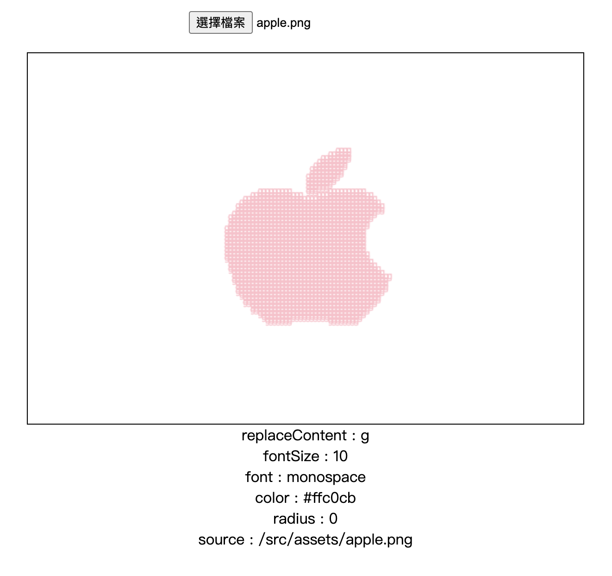

# Canvas Meme Image

Canvas Meme Image is an npm package based on TypeScript and Vue that allows you to upload an image and convert it to text. This tool is particularly useful for generating image text, creating MEME images, or performing image processing.

## Features

- Upload images
- Convert images to text
- Easy-to-use interface
- Developed with TypeScript and Vue

## Installation

Install using npm or yarn:

```bash
npm install @eepson123tw/canvas-meme
# or
yarn add @eepson123tw/canvas-meme
```

## props

| Property       | Type   | Required | Default     | Description                                                        |
| -------------- | ------ | -------- | ----------- | ------------------------------------------------------------------ |
| replaceContent | string | Yes      | "啊"        | The content that will replace certain pixels in the image.         |
| fontSize       | number | No       | 2           | The font size used for the replacement content on the canvas.      |
| font           | string | No       | "monospace" | The font style used for the replacement content on the canvas.     |
| color          | string | No       | N/A         | The color of the replacement content on the canvas.                |
| radius         | number | No       | N/A         | The radius of the area affected by the replacement content.        |
| source         | string | No       | N/A         | The source URL of an image to be loaded into the canvas initially. |
| canvasWidth    | number | No       | 600         | The width of the canvas.                                           |
| canvasHeight   | number | No       | 400         | The height of the canvas.                                          |

### Explanation of `Props` Interface

- **replaceContent**: This is a string that will be used to replace certain pixels on the canvas. For example, it might replace pixels that meet a certain color threshold.
- **fontSize**: An optional property specifying the size of the font used for the replacement content. If not provided, it defaults to `2`.
- **font**: An optional property specifying the font family to be used for the replacement content. The default value is `"monospace"`.
- **color**: An optional property that determines the color of the replacement content. If not specified, the default color will be used.
- **radius**: An optional property that might be used to specify the radius of the area affected by the replacement content. This is not used in the current script but might be included for future enhancements.
- **source**: An optional string that specifies the URL of an image to be initially loaded into the canvas. If provided, the image from this URL will be drawn on the canvas when the component mounts.
- **canvasWidth**: An optional property that specifies the width of the canvas element. The default value is `600`.
- **canvasHeight**: An optional property that specifies the height of the canvas element. The default value is `400`.

## Usage



## Contributing

We welcome contributions and issue reports. Please follow our contribution guidelines.

## License

This project is licensed under the MIT License.
